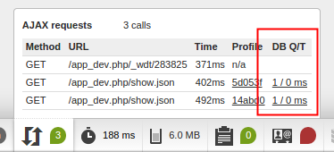

sf2-ajax-db-profiling-toolbar
=============================

## Extra Ajax Debugging DB Details



Symfony2 introduced new [Ajax requests profiling](http://symfony.com/blog/new-in-symfony-2-6-ajax-requests-in-the-web-debug-toolbar) in 2.6 version.
One thing that I was missing still few details about these requests:

* how many database queries were made,
* how much time they took,
* easy, direct access to database profiling page for each of them.

File in this repository is a modified profile javascript file that does
all things mentioned above. Putting it in your app/Resources directory
will use templates [overriding feature](http://symfony.com/doc/current/book/templating.html#overriding-bundle-templates) in Symfony2.

Now database profiling in Symfony2 application with Ajax should be much easier.

## How it works?

It grabs profiling pages for each Ajax request and parses for Queries Count and Queries Time.

## Installation

1. Get the file as it is:

  ```
  app/Resources/WebProfilerBundle/views/Profiler/base_js.html.twig
  ```
  and put it in your Symfony2 project.
2. Clear cache (even in debug mode):

  ```
  php app/console cache:clear
  ```

Tested with Symfony2 v2.6.[0-3].

Happy Profiling ! 
